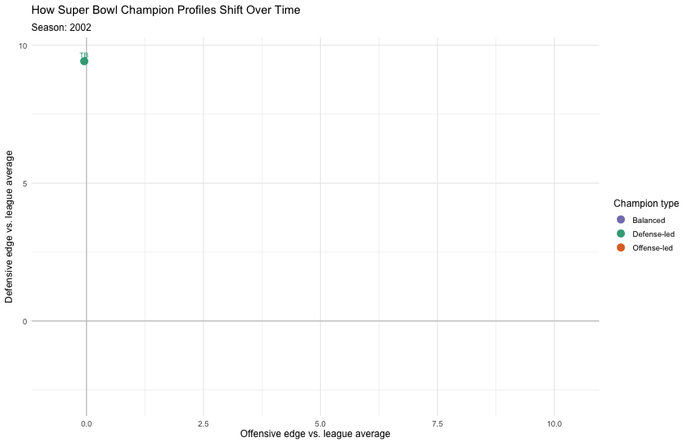

## 1. Introduction

Sports fans repeat one NFL slogan all the time:

**Defense wins championships.**

But does that idea still hold in the modern NFL?
This project looks only at Super Bowl winners since 2002 and asks whether champions have been more defense-led, offense-led, or balanced across different eras.

The goal is not to explain regular-season success in general.
Instead, it is to test whether championship teams really have been driven more by defense than offense, and whether that pattern has changed over time.

## 2. Data

The dataset comes from nflverse standings data:

- Source: <https://github.com/nflverse/nfldata/raw/master/data/standings.csv>
- Unit of analysis: one team in one season
- Core fields: wins, losses, ties, points scored, points allowed, point differential, playoff result, and seed
- Time window: 2002 through the latest completed season in the file

```{r}
library(tidyverse)
library(ggplot2)
library(ggthemes)

# Read the saved standings file.
standings_raw <- read_csv("data/standings.csv", show_col_types = FALSE)

# Clean the raw data and create simple season-level metrics.
team_season <- standings_raw |>
  mutate(
    franchise_team = recode(
      team,
      STL = "LA",
      SD = "LAC",
      OAK = "LV",
      .default = team
    ),
    games_played = wins + losses + ties,
    champion_flag = playoff == "WonSB",
    points_for_pg = scored / games_played,
    points_allowed_pg = allowed / games_played,
    point_diff_pg = net / games_played
  ) |>
  filter(
    season >= 2002,
    games_played >= 16,
    scored > 0,
    allowed > 0
  ) |>
  mutate(
    era = case_when(
      season <= 2010 ~ "2002-2010",
      season <= 2020 ~ "2011-2020",
      TRUE ~ "2021-present"
    )
  )

# Find the league average scoring environment for each season.
season_averages <- team_season |>
  group_by(season) |>
  summarise(
    league_points_for_pg = mean(points_for_pg, na.rm = TRUE),
    league_points_allowed_pg = mean(points_allowed_pg, na.rm = TRUE),
    .groups = "drop"
  )

# Compare each team to the league average in its own season.
team_season <- team_season |>
  left_join(season_averages, by = "season") |>
  mutate(
    offense_vs_league = points_for_pg - league_points_for_pg,
    defense_vs_league = league_points_allowed_pg - points_allowed_pg,
    strongest_unit = case_when(
      abs(offense_vs_league - defense_vs_league) <= 1 ~ "Balanced edge",
      offense_vs_league > defense_vs_league ~ "Offense was stronger",
      TRUE ~ "Defense was stronger"
    )
  )

# Keep only Super Bowl winners and label them in simpler language.
champions_display <- team_season |>
  filter(champion_flag) |>
  arrange(season) |>
  mutate(
    strongest_side = recode(
      strongest_unit,
      "Offense was stronger" = "Offense-led",
      "Defense was stronger" = "Defense-led",
      "Balanced edge" = "Balanced"
    )
  )

# Create an era summary for the chart later in the report.
champion_era_summary <- champions_display |>
  group_by(era) |>
  summarise(
    avg_offense_edge = mean(offense_vs_league, na.rm = TRUE),
    avg_defense_edge = mean(defense_vs_league, na.rm = TRUE),
    avg_point_diff_pg = mean(point_diff_pg, na.rm = TRUE),
    .groups = "drop"
  )

team_season |>
  summarise(
    min_season = min(season),
    max_season = max(season),
    team_seasons = n(),
    champions_in_file = sum(champion_flag),
    unique_franchises = n_distinct(franchise_team)
  )
```

## 3. Data Transformation and Descriptive Statistics

### Transformations used

- Filtered to completed team-seasons (`games_played >= 16`)
- Created per-game metrics for fair comparisons across 16-game and 17-game eras:
  - `points_for_pg`
  - `points_allowed_pg`
  - `point_diff_pg`
- Created a `champion_flag` indicator using `playoff == "WonSB"`
- Measured team quality relative to league averages in the same season:
  - `offense_vs_league`
  - `defense_vs_league`
- Classified each champion by its stronger side:
  - `Defense-led`
  - `Offense-led`
  - `Balanced`

Overall, the slogan is only partly right.
Across all champions since 2002, offense-led winners appear slightly more often than defense-led winners.

```{r}
champions_display |>
  count(strongest_side, sort = TRUE)
```

The more interesting pattern shows up across eras.
In the 2002-2010 era, defense-led champions were the most common type.
By the 2011-2020 era, offense-led champions had become more common.
In the newest era in this file, no champion is classified as defense-led.

```{r}
champions_display |>
  count(era, strongest_side)
```

## 4. Data Visualization and Storytelling

### Figure 1. The overall myth is too simple

```{r}
champions_display |>
  count(strongest_side, sort = TRUE) |>
  ggplot(aes(x = reorder(strongest_side, n), y = n, fill = strongest_side)) +
  geom_col(width = 0.7, show.legend = FALSE) +
  geom_text(aes(label = n), hjust = -0.1, size = 4) +
  coord_flip() +
  labs(
    title = "Super Bowl winners are not mostly defense-led",
    subtitle = "Champion profiles since 2002",
    x = "Champion type",
    y = "Number of champions"
  ) +
  theme_minimal(base_size = 12)
```

If the old slogan were fully true, defense-led champions would dominate the chart.
They do not.
Defense clearly matters, but offense-led champions are slightly more common across the full period.

### Figure 2. The answer changes across eras

```{r}
champions_display |>
  count(era, strongest_side) |>
  ggplot(aes(x = era, y = n, fill = strongest_side)) +
  geom_col(width = 0.7) +
  labs(
    title = "Defense was more common earlier, offense more common later",
    subtitle = "Champion profile by era",
    x = "Era",
    y = "Number of champions",
    fill = "Champion type"
  ) +
  theme_minimal(base_size = 12)
```

This is the most important chart in the project.
The early modern NFL still had a strong defense-first feel, but that pattern faded over time.
The data suggest that the meaning of a championship-caliber team has shifted with the league's broader offensive evolution.

### Figure 3. Modern champions have a bigger offensive edge than defensive edge

```{r}
champion_era_summary |>
  select(era, avg_offense_edge, avg_defense_edge) |>
  pivot_longer(
    cols = c(avg_offense_edge, avg_defense_edge),
    names_to = "metric",
    values_to = "edge"
  ) |>
  mutate(
    metric = recode(
      metric,
      avg_offense_edge = "Average offense edge",
      avg_defense_edge = "Average defense edge"
    )
  ) |>
  ggplot(aes(x = era, y = edge, fill = metric)) +
  geom_col(position = position_dodge(width = 0.75), width = 0.65) +
  labs(
    title = "Champion strength has tilted toward offense in recent eras",
    subtitle = "Average advantage relative to league average",
    x = "Era",
    y = "Points per game relative to league average",
    fill = "Metric"
  ) +
  theme_minimal(base_size = 12)
```

The shift is not just about counts.
The average champion in the 2002-2010 era had a slightly bigger defensive edge than offensive edge.
By the most recent era, the gap flips clearly toward offense.

### Figure 4. Great champions are still usually complete teams

```{r}
ggplot(team_season, aes(x = offense_vs_league, y = defense_vs_league)) +
  geom_hline(yintercept = 0, color = "gray75", linewidth = 0.5) +
  geom_vline(xintercept = 0, color = "gray75", linewidth = 0.5) +
  geom_point(color = "gray70", alpha = 0.25) +
  geom_point(
    data = champions_display,
    aes(color = strongest_side),
    size = 3
  ) +
  geom_text(
    data = champions_display,
    aes(label = paste(team, season), color = strongest_side),
    size = 3,
    nudge_y = 0.2,
    check_overlap = TRUE,
    show.legend = FALSE
  ) +
  labs(
    title = "Champions usually win with balance plus one stronger side",
    subtitle = "Gray points are all team-seasons; labeled points are champions",
    x = "Offensive edge vs. league average points per game",
    y = "Defensive edge vs. league average points allowed per game",
    color = "Champion type"
  ) +
  theme_minimal(base_size = 12)
```

This final plot helps keep the conclusion honest.
Even recent offense-led champions are rarely one-dimensional teams.
Most Super Bowl winners are still above league average on both offense and defense, but the side that stands out most has increasingly been offense rather than defense.

### Homework 6 Interactive and Animated Visuals

The interactive version of the champion profile plot lets readers hover over each Super Bowl winner to see the team, season, champion type, offensive edge, defensive edge, and point differential per game.

```{=html}
<iframe src="homework6-interactive-plot.html" style="width: 100%; height: 650px; border: none;"></iframe>
```

The animation shows how the Super Bowl champion profile moves across seasons, using the same offense-versus-defense comparison from the main story.



## 5. Conclusion

So, does defense really win championships?

The best answer from this dataset is:
**not as often as the slogan suggests, and not nearly as much in the modern era.**

- In the early 2000s, defense-led champions were common.
- From the 2010s forward, offense-led champions became more common.
- In the newest era of this file, champions still look balanced overall, but their stronger side is usually offense.

That means the old saying is not completely wrong, but it is outdated as a full explanation.
Defense still matters, but modern NFL champions are increasingly defined by offensive advantage layered on top of overall team balance.

## 6. References (Optional)

- nflverse `standings.csv`: <https://github.com/nflverse/nfldata/raw/master/data/standings.csv>
